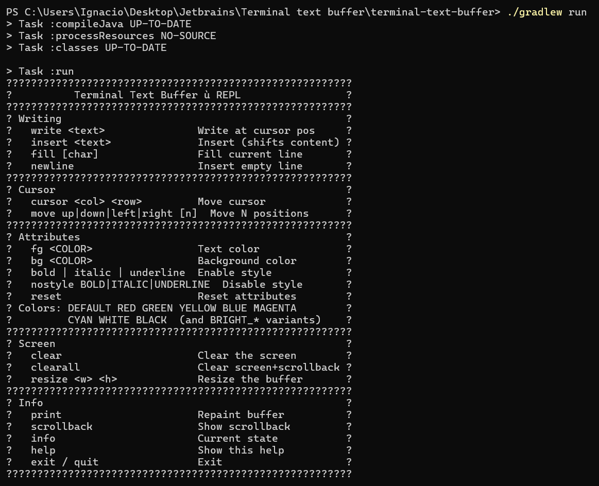
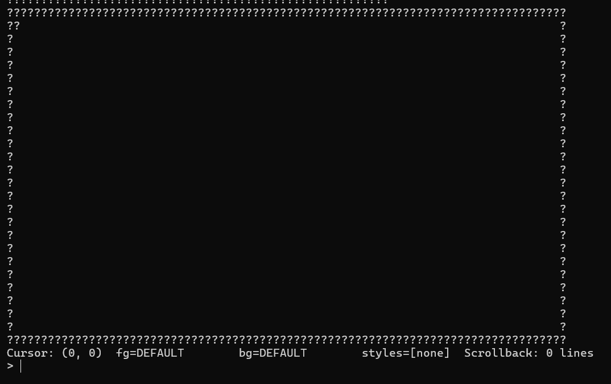

# Terminal Text Buffer

[](https://github.com/igarbayo/terminal-text-buffer/actions/workflows/ci.yml)
[](https://api.reuse.software/info/github.com/igarbayo/terminal-text-buffer)

> A terminal text buffer implementation in Java — the core data structure used by
> terminal emulators to store, edit, and render text output.




---

## What is this?

When a shell prints output, something has to keep track of what character is in
each cell of the screen, what colour it has, and where the cursor is. That
"something" is a terminal buffer.

This library implements that data structure from scratch in Java, without any
external runtime dependencies. It is meant for developers who are:

- building a terminal emulator or TUI framework,
- studying how terminal emulators work internally, or
- looking for a clean, tested reference implementation.

It is **not** a terminal emulator itself — it does not parse escape sequences,
drive a display, or handle input events. It is the data layer only.

---

## Known Limitations

Be aware of these before you use it:

- **Wide characters in Windows PowerShell / CMD:** PowerShell replaces CJK
  ideographs and many emoji with `?` before they reach the JVM. Wide character
  support works correctly in the library (verified by the automated test suite)
  but cannot be tested interactively from those terminals. Use IntelliJ's
  built-in terminal or Windows Terminal with `chcp 65001`.

---

## Quick Start

**Requirements:** Java 8+, no external runtime dependencies.

```bash
git clone https://github.com/igarbayo/terminal-text-buffer.git
cd terminal-text-buffer
./gradlew test
```

All 14 test classes run. The HTML report is at
`build/reports/tests/test/index.html`.

> **Windows note:** if Gradle cannot find the compiler, set
> `org.gradle.java.home` in `gradle.properties` to point to your JDK (not JRE):
> ```
> org.gradle.java.home=C:\\Program Files\\Java\\jdk1.8.0_261
> ```

### Use the buffer in your code

```java
// Create an 80x24 buffer with 500 lines of scrollback
TerminalBuffer buf = new TerminalBuffer(80, 24, 500);

// Set attributes and write
buf.setForeground(TerminalColor.RED);
buf.addStyle(TextStyle.BOLD);
buf.writeText("Hello, terminal!");

// Move the cursor and write more
buf.setCursor(0, 1);
buf.resetAttributes();
buf.writeText("Normal text on row 1");

// Read back
String line0 = buf.getLine(0);   // "Hello, terminal!"
char   ch     = buf.getChar(0, 0); // 'H'
```

---

## Interactive REPL

A command-line REPL lets you poke at the buffer manually:

```bash
./gradlew run
```

Type `help` at the prompt to see all commands, or consult the
[manual testing guide](docs/MANUAL_TESTING_GUIDE.md) for a full walkthrough
with expected output.

| Command | What it does |
|---|---|
| `write <text>` | Write text at cursor position (overwrite) |
| `insert <text>` | Insert text at cursor, shifting content right |
| `fill [char]` | Fill current line with character (space if omitted) |
| `newline` | Insert empty line at bottom, scroll top to scrollback |
| `clear` | Clear screen and reset cursor to (0, 0) |
| `clearall` | Clear screen, scrollback, and reset cursor |
| `cursor <col> <row>` | Move cursor to position |
| `move up\|down\|left\|right [n]` | Move cursor N steps (default 1) |
| `fg <COLOR>` | Set foreground color |
| `bg <COLOR>` | Set background color |
| `bold` / `italic` / `underline` | Enable text style |
| `nostyle <STYLE>` | Disable text style |
| `reset` | Reset all attributes to default |
| `resize <w> <h>` | Resize the buffer |
| `print` | Repaint the buffer |
| `scrollback` | Print scrollback history |
| `info` | Show dimensions, cursor, and current attributes |
| `codepoints <text>` | Show Unicode code points (debug) |
| `exit` / `quit` | Exit the REPL |

Colors: `DEFAULT RED GREEN YELLOW BLUE MAGENTA CYAN WHITE BLACK` and `BRIGHT_*` variants.

---

## Compatibility

Tested on every combination in CI:

| Java version | Ubuntu | Windows |
|---|---|---|
| 11 | Passing | Passing |
| 17 | Passing | Passing |
| 21 | Passing | Passing |

Wide character support (CJK + emoji) is verified by the automated test suite on
all platforms. Interactive display of wide characters requires a Unicode-aware
terminal — see [Known Limitations](#known-limitations).

---

## Troubleshooting

### `Could not find tools.jar` on Windows

Gradle is picking up a JRE instead of a JDK. Set `org.gradle.java.home` in
`gradle.properties` to point to a JDK directory (the one that contains `bin/javac`):

```properties
org.gradle.java.home=C:\\Program Files\\Java\\jdk1.8.0_261
```

Or set `JAVA_HOME` in your terminal before running Gradle:

```powershell
$env:JAVA_HOME = "C:\Program Files\Java\jdk1.8.0_261"
./gradlew test
```

### Wide characters display as `?` in Windows PowerShell / CMD

PowerShell and CMD do not forward CJK ideographs or many emoji to the JVM — they
replace them with `?` before the Java process ever receives the input. This is an
OS-level limitation. The library itself handles wide characters correctly (verified
by the automated test suite). To test interactively, use:

- **IntelliJ IDEA's built-in terminal**
- **Windows Terminal** with `chcp 65001` (UTF-8 code page)

### Build succeeds but tests are reported as `UP-TO-DATE` without running

Gradle cached the last run. Force a fresh run with:

```bash
./gradlew cleanTest test
```

### `UnsupportedClassVersionError` at runtime

The class was compiled with a newer JDK than the one running it. Make sure the
JDK used to build (`JAVA_HOME`) and the JDK used to run are the same version, or
at least that the runtime is at least Java 8.

---

## Architecture & Design

```
                    ┌───────────────────────────────────────────────────┐
                    │              TerminalBuffer (public API)          │
                    │                                                   │
                    │  cursor: CursorPosition                           │
                    │  attrs:  CellAttributes  (fg, bg, styles)         │
                    │                                                   │
                    │  ┌──────────────────────┐  ┌──────────────────┐   │
                    │  │      Screen          │  │    Scrollback    │   │
                    │  │  Row[height]         │  │  Row[] circular  │   │
                    │  │  (mutable, editable) │  │  (read-only;     │   │
                    │  │                      │  │   max size cap)  │   │
                    │  │  row 0 = top line    │  │  -1 = newest     │   │
                    │  │  row h-1 = bottom    │  │  -n = oldest     │   │
                    │  └──────────────────────┘  └──────────────────┘   │
                    │           │                          │            │
                    │           └──────────┬───────────────┘            │
                    │                      │                            │
                    │               Row  ──┤ Cell[]  (fixed width)      │
                    │                      │                            │
                    │               Cell ──┤ char + CellAttributes      │
                    │                      │ + CellType                 │
                    │                      │ (NORMAL/WIDE_LEFT/         │
                    │                      │  WIDE_RIGHT)               │
                    └──────────────────────┴────────────────────────────┘

  CellAttributes = TerminalColor (fg) + TerminalColor (bg) + Set<TextStyle>
  TerminalColor  = DEFAULT | BLACK | RED | GREEN | YELLOW | BLUE |
                   MAGENTA | CYAN | WHITE | BRIGHT_* variants (17 total)
  TextStyle      = BOLD | ITALIC | UNDERLINE
```

When `insertEmptyLine()` is called (or the cursor reaches the bottom), the top
screen row is snapshotted (copy-constructor) and pushed to the back of the
scrollback deque. If the deque is at capacity the oldest entry is evicted from
the front.

### Class Overview

```
TerminalColor (enum)       — 16 standard colors + DEFAULT (17 values)
TextStyle (enum)           — BOLD, ITALIC, UNDERLINE
CellAttributes (immutable) — fg color + bg color + EnumSet<TextStyle>
Cell (immutable)           — int codePoint + CellAttributes + CellType (NORMAL/WIDE_LEFT/WIDE_RIGHT)
Row (package-private)      — mutable fixed-width array of Cells
CursorPosition (immutable) — (col, row) value object
TerminalBuffer (public)    — the main API class
```

For the full rationale and alternatives considered for each decision, see
[ARCHITECTURE_DECISIONS.md](docs/ARCHITECTURE_DECISIONS.md).

### Key Design Decisions

#### Immutability strategy: Cell immutable, Row mutable

`Cell` and `CellAttributes` are immutable value objects. This makes it safe to
share `Cell.EMPTY` everywhere without defensive copying, and ensures that
scrollback history cannot be accidentally modified after a row is pushed there.

`Row` is mutable (package-private) — writing a character is O(1) instead of
creating a new row array on every keystroke. When a row is pushed into
scrollback, a copy-constructor snapshot is taken (`new Row(original)`), so
future mutations to the screen row do not corrupt history.

#### Color and style representation

`TerminalColor` is a 17-value enum (DEFAULT + 16 standard ANSI colors).
`TextStyle` flags use `EnumSet<TextStyle>`, backed by a long bitmask internally
— compact, type-safe, and no custom bitfield arithmetic needed.

#### Scrollback storage

A fixed-size `Row[]` circular buffer with `sbHead` (index of the oldest entry)
and `sbCount` (number of live entries). Push and eviction are O(1); random
access by index is also O(1) via `scrollback[(sbHead + sbCount + n) % maxScrollback]`.

#### Coordinate system

- **Screen**: row `[0, height-1]`, where row 0 is the top visible line.
- **Scrollback**: row `[-scrollbackSize, -1]`, where row -1 is the most
  recently scrolled-off line and `-scrollbackSize` is the oldest.

This signed-integer convention unifies all content-access methods under a
single `int row` parameter without needing a separate type or flag.

#### Wide character support

Uses the **placeholder cell strategy** (same as xterm, VTE, and most real
terminal emulators):

- A wide glyph at column `c` sets `cells[c] = WIDE_LEFT` and
  `cells[c+1] = WIDE_RIGHT`.
- `WIDE_RIGHT` stores `'\0'` and is skipped in `toContentString()`.
- Writing over either half of a wide pair automatically clears both halves.
- A wide char that does not fit at the right edge is skipped.

Detection uses Unicode block ranges directly (not `Character.getType()`, which
is too restrictive for some ranges).

#### `writeText` — pending wrap flag

When the last character is written to column `width-1`, the cursor stays there
and `pendingWrap = true` is set internally. The next `writeText` call resolves
the wrap first — advances to column 0 of the next row (inserting a new line if
at the bottom) — then writes. This matches xterm behaviour.

#### `insertText` — push-down wrapping

Inserts at the cursor, shifting existing row content right. Overflow flows to
subsequent rows recursively:

1. Capture content from cursor column to end of row.
2. Merge: `combined = [new cells] + [existing]`.
3. Write the first `(width - cursorCol)` cells back.
4. If overflow contains actual content, recurse at column 0 of the next row.
5. If overflow reaches the last row, `insertEmptyLine()` is called — the top
   row scrolls into scrollback.

#### `getLine` vs `getRawLine`

- `getLine(row)` — content with trailing spaces trimmed. Convenient for tests.
- `getRawLine(row)` — fixed-width string (always `width` characters). For
  width-sensitive rendering.

#### Resize

`resize(newWidth, newHeight)` handles four cases:

- **Wider**: rows padded with `Cell.EMPTY` at the right.
- **Narrower**: rows truncated at the new width.
- **Taller**: new empty rows appended at the bottom.
- **Shorter**: rows removed from the top enter scrollback.

---

## Trade-offs and Known Limitations

- **`insertText` cursor position after overflow**: Cursor arithmetic is based
  on total character count relative to the cursor start. Consistent in the
  current implementation; could be refined for complex multi-line inserts.

- **`hasActualContent` trailing spaces**: Spaces from empty rows are suppressed
  to avoid infinite blank-cell propagation. Intentional trailing spaces at the
  end of a full row would be dropped.

---

## Potential Improvements

- Add `Bidi` (bidirectional text) support for RTL languages.
- Add `SGR` (Select Graphic Rendition) parsing to process ANSI escape sequences directly.
- Add alternate screen buffer support (used by fullscreen TUI apps like vim).

---

## Development Process

Built using **TDD (Test-Driven Development)** in a bottom-up order:

1. Value objects (`CellAttributes`, `Cell`) — tested in isolation first
2. `Row` — the storage primitive
3. `TerminalBuffer` skeleton with cursor and dimensions
4. Attribute state management
5. `clearScreen` / `clearAll` + basic content access
6. `writeText` with pending-wrap flag
7. `fillLine`
8. `insertEmptyLine` + scrollback
9. `insertText` with push-down wrapping
10. Content access edge cases (`getLine`, `getAllContent`)
11. Wide character support
12. Resize

Commits are signed with PGP. Branch strategy follows Git Flow —
see [GOVERNANCE.md](GOVERNANCE.md) for details.

---

## Contributing

Contributions, questions and feedback are welcome.
Please read [CONTRIBUTING.md](CONTRIBUTING.md) before opening a pull request.

---

## License

This project is licensed under the **MIT License** — see [LICENSE](LICENSE) for
the full text.

The choice of MIT reflects the academic nature of this project: maximum freedom
to study, adapt, and reuse, with no restrictions on how you use it.

Third-party component licenses are listed in
[COMPONENTS_LICENSE.md](docs/COMPONENTS_LICENSE.md).

[](https://api.reuse.software/info/github.com/igarbayo/terminal-text-buffer)

<!-- SPDX-FileCopyrightText: 2026 Ignacio Garbayo Fernández <ignacio.garbayo@rai.usc.es> -->
<!-- SPDX-License-Identifier: MIT -->
